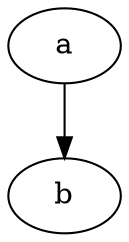

# Home

In `book.toml`, make sure you have:

```toml
[preprocessor.graphviz]
command = "mdbook-graphviz"
output-to-file = false

[output.html]
additional-css = ["src/css/graph_style.css"]
```

`graph_style.css` will be served from the HTML root.

In `page.md`, graphs should reference the file name without the preceeding path:



It is also possible to alter element styles using JS if the SVG is rendered inline.

<input
    id="show_hide"
    type="checkbox"
    checked
    onclick="toggle();">show / hide</input>

<script type="text/javascript">
function toggle() {
    let checkbox = document.querySelector('#show_hide');
    if (checkbox.checked) {
        document.querySelector('.sky > ellipse').style.setProperty('visibility', 'visible');
    } else {
        document.querySelector('.sky > ellipse').style.setProperty('visibility', 'hidden');
    }
}
</script>
